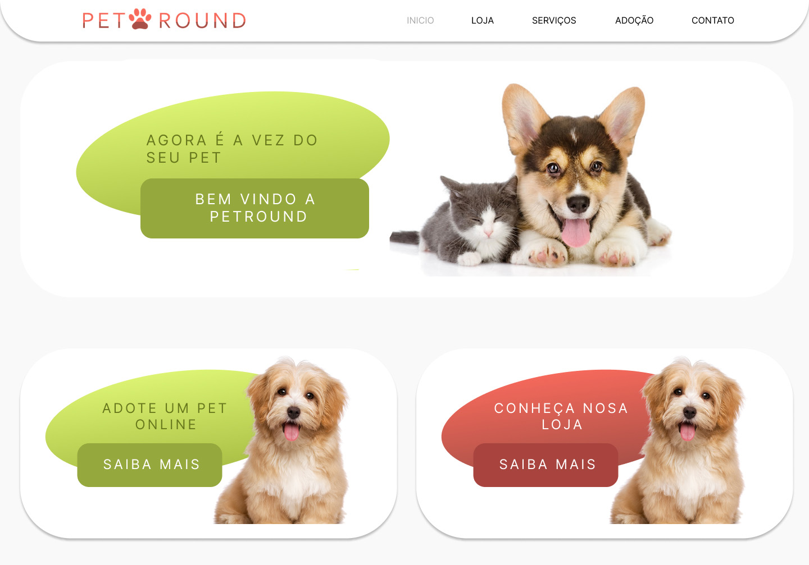
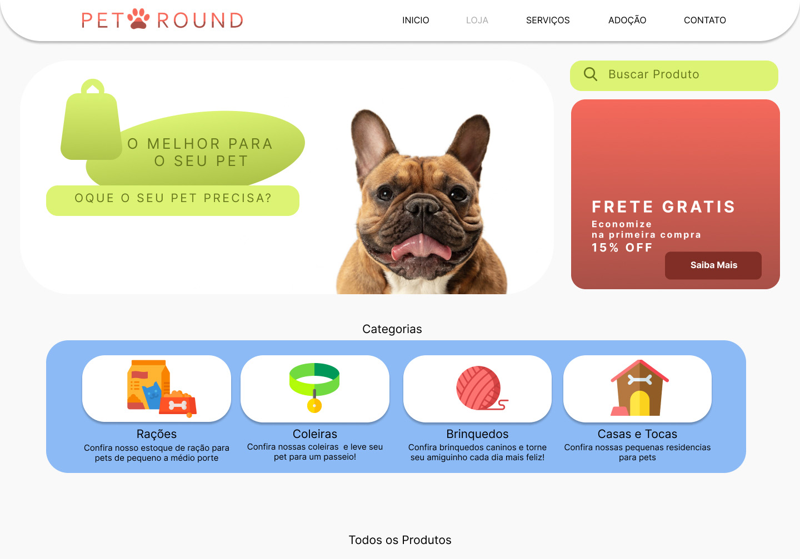

# Petshop-project

Meu primeiro projeto como estudante da área foi a prototipação desse PetShop fictício!   Confira o PetRound! um site de adoção e venda de produto e serviços.

 

  
  

<h3> Objetivo deste projeto</h3>

Criar a base com as estruturas de interface mais básicas de um site de Petshop. <b>versão HTML e CSS EM PROCESSO</b>.
 

